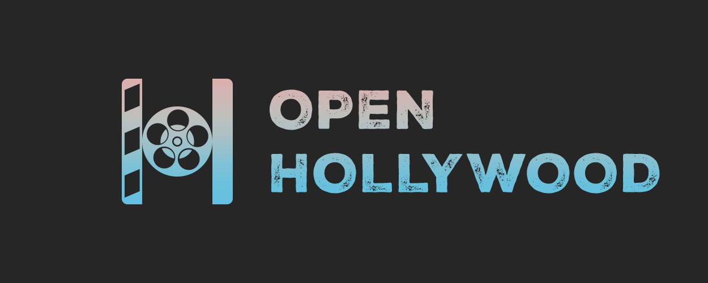

<div align="center">



</div>


# 🎬 Open Hollywood - AI Scene Execution Engine

Open Hollywood is a system where AI agents execute theatrical scenes like actors in Hollywood movies and Broadway theater shows, with Zero human involvement during execution (only setup required). 

Open Hollywood is a sibling project to [SammyAI](https://github.com/sasadjukic/sammyai) that tries to solve a few important issues when LLMs are tasked to generate creative content. Both SammyAI and Open Hollywood are currently developed and tested separately to give a chance for troubleshooting problems in isolated, smaller environments.

>[!NOTE]
>As of April 4, 2026 Open Hollywood uses Gemma4:e4b model as the engine testing model

In this testing phase, Open Hollywood is using local LLM models to perfect the engine dynamics. Once the engine dynamics are sorted out, Open Hollywood will be ready for use with all other LLM models. 

In this very early stage of development, Open Hollywood tests scenes with two actors (AI agents) with the ability to create custom characters on the fly.

## Key Features

- **Default Scenes**: Run the pre-built Confession scene with Father Aldric and Marco Bellini
- **Custom Characters**: Create your own characters with custom names, descriptions, and detailed constitutions (up to 1000 characters each)
- **Dynamic Director Prompts**: Director prompts are auto-generated based on scene genre and character data
- **Real-time Dialogue Streaming**: Watch AI agents execute scenes in real-time via WebSocket
- **Emotional Arc Tracking**: Monitor scene progression through emotional stages (opening → tension → climax → resolution)
- **Smart Scene Ending**: Scenes auto-end when director detects proper closure

## Architecture Overview

The system is built around these core components:

### 1. **Prompt Builder**
Assembles final system prompts from three building blocks:
- Character Constitution (fixed character definition)
- Genre Block (genre-specific performance directions)
- Scene Context (episode setup)

**New in v2**: Director prompts are now auto-generated from GenreBlock data when not explicitly provided, ensuring consistency across custom scenes.

### 2. **Agents**
Two isolated LLM instances with independent perspectives:
- Each agent has their own system prompt
- Each sees the other's dialogue as "user" messages
- Powered by Ollama's Gemma4:e4b model
- Supports custom character definitions created at runtime

### 3. **Orchestrator**
Traffic controller managing scene flow:
- Alternates turns between characters
- Maintains shared dialogue history
- Enforces turn limits
- Triggers director after each turn

### 4. **Director Agent**
Evaluates scene state after every turn:
- Tracks emotional arc (opening → tension → climax → resolution)
- Detects scene ending conditions
- Injects stage directions for next turn
- Returns structured JSON state

**New in v2**: Director system prompts are optional and automatically generated from GenreBlock when not provided, supporting custom scenes seamlessly.

### 5. **Web UI**
Real-time scene viewer with:
- Landing page with choice between default and custom scenes
- Character creation form for custom scenes
- Live dialogue streaming with character-specific colors
- Emotional arc tracking
- Thread resolution display
- Stage direction annotations

## Prerequisites

1. **Python 3.10+** (already set up in virtual environment)
2. **Ollama** installed and running with `gemma4:e4b` model
   ```bash
   # Install Ollama from https://ollama.ai
   ollama pull gemma4:e4b
   ollama serve
   ```

## Technical Details

### Director Prompt Generation

The director system prompt can now be handled in two ways:

1. **Auto-Generated** (for custom scenes):
   - Generated from GenreBlock (ending types and weights)
   - Automatically includes character names and descriptions
   - Ensures format consistency across all custom scenes
   
2. **Explicit** (for pre-built scenes like Confession):
   - Can provide a custom director prompt if needed
   - Falls back to auto-generation if not provided
   - Backward compatible with existing hardcoded prompts

### Data Model

**SceneConfig** now has an optional `director_system_prompt` field:
```python
director_system_prompt: Optional[str] = None  # Auto-generated if not provided
```

This allows scenes to be defined without a hardcoded prompt, making the system more flexible and scalable.

## Running the Application

### Start the Server

```bash
python run.py
```

Or with custom settings:
```bash
python run.py --host 0.0.0.0 --port 8000 --reload
```

The server will start at `http://127.0.0.1:8000`

### 2. Open in Browser

Navigate to: **http://127.0.0.1:8000**

## Usage Guide

### Setup Phase (Only Human Involvement Needed)

When you navigate to the web interface, you'll first see the **Landing Page** with two choices:

#### **Option 1: Use Default Scene**
Perfect for quickly seeing Open Hollywood in action:

1. Click **"Use Default Scene"** button
2. The form pre-fills with Father Aldric and Marco Bellini
3. All fields are read-only to show you this is a preset configuration
4. Click **"Start Scene"** to watch the Confession scene execute

#### **Option 2: Build Custom Scene**
Create your own characters and scene:

1. Click **"Build Custom Scene"** button
2. **Fill in Character 1:**
   - Name (e.g., "Detective Smith")
   - Description (e.g., "A hardened cop")
   - Constitution (up to 1000 characters of backstory, personality, speech patterns, etc.)
   - Character counter shows progress (e.g., "342/1000")

3. **Fill in Character 2:**
   - Name (e.g., "Suspect Jane")
   - Description (e.g., "A nervous witness")
   - Constitution (detailed backstory)

4. **Configure Scene Settings:**
   - Scene Title (e.g., "Interrogation")
   - Genre (select from: Dark Comedy, Drama, Thriller, Comedy, Tragedy)
   - Scene Context (describe the setting and initial situation)
   - Maximum Turns (default: 30)
   - Minimum Turns (default: 6, before early ending is allowed)

5. Click **"Start Scene"**

### Scene Execution

Once the scene starts:
1. **Real-time Dialogue**: Watch the dialogue stream in real-time with character names
2. **Character Colors**: Each character displays in a distinct color (assigned sequentially from the palette)
3. **Emotional Arc**: Monitor the scene's emotional progression (opening → tension → climax → resolution)
4. **Threads Tracking**: View unresolved and resolved emotional threads
5. **Stage Directions**: See director's guidance for the next turn
6. **Auto-End**: Scene automatically ends when director detects proper closure

**Controls:**
- **Stop**: Manually stop the scene if needed
- **Reset**: Return to the landing page

### Using the Default Scene

The **Confession scene** features:
- **Father Aldric Voss** (61-year-old Catholic priest): A compassionate guide seeking spiritual truth
- **Marco Bellini** (38-year-old penitent): A man hiding a significant sin, gradually revealing his burden

The scene explores confession, guilt, redemption, and the possibility of unexpected human connection.

## Extensibility

### Adding New Genres

Edit `app/orchestrator/scene_orchestrator.py` and add to `GENRE_BLOCKS`:

```python
Genre.YOUR_GENRE: GenreBlock(
    genre=Genre.YOUR_GENRE,
    performance_directions="Your genre instructions...",
    ending_types=["TYPE1", "TYPE2", ...],
    ending_weights={"TYPE1": 0.5, "TYPE2": 0.5, ...}
)
```

### Creating Custom Characters

Custom characters are now created directly in the web interface:

1. Click **"Build Custom Scene"** on the landing page
2. Define your character with:
   - **Name**: Character's name as it appears in dialogue
   - **Description**: Brief summary (e.g., "A weary detective")
   - **Constitution**: Full character prompt (up to 1000 characters)
     - Personality traits
     - Speech patterns and mannerisms
     - Motivations and secrets
     - How they react to conflict
     - Any special knowledge or skills

**Example Constitution for a Detective:**
```
You are Detective Morgan, 40 years old, with 15 years on the force. You're direct, 
observant, and patient. You speak casually but precisely. You've seen a lot and 
rarely get surprised. Your goal in this interview is to get at the truth, but you 
do it by building rapport, not by making accusations. You're skeptical but fair.
```

**Note**: Constitutions should be detailed enough for the AI to understand the character deeply without being overly long. Aim for 200-800 characters for best results.

### Character Templates (For Future Implementation)

Default characters are defined in `app/core/scene_templates.py`:
- **CharacterTemplates.FATHER_ALDRIC**: The compassionate priest
- **CharacterTemplates.MARCO_BELLINI**: The conflicted penitent

These serve as reference implementations and can be reused or extended.

## Key Design Principles

1. **Modularity**: Each component (Prompt Builder, Agents, Orchestrator, Director) is independent
2. **Extensibility**: New genres, characters, and ending types can be added without modifying core logic
3. **Isolation**: Agents maintain separate perspectives - no prompt bleeding
4. **Determinism**: Scene state is tracked precisely for consistent, realistic execution
5. **Real-time**: WebSocket provides live scene updates to browsers

## Project Roadmap

### ✅ Completed (v2.0)
- [x] Dynamic character creation in web UI
- [x] Landing page with choice between default and custom scenes
- [x] Character form with 1000-character constitution limit
- [x] Live character counter during input
- [x] Optional director prompts (auto-generated from GenreBlock)
- [x] Custom character support in scene execution
- [x] Character-specific color coding in dialogue display
- [x] `/api/templates/default` endpoint for default scene
- [x] `/api/scenes` endpoint accepts custom characters

### 🔄 In Development / Planned
- [ ] Persistent character templates (save/load custom characters)
- [ ] Multi-character scenes (3+ actors)
- [ ] Director customization
- [ ] Scene recording and playback
- [ ] Character library search
- [ ] Advanced emotional arc visualization
- [ ] Dialogue branching based on character choice

## API Endpoints

### Get Default Scene
```
GET /api/templates/default
```
Returns the pre-built Confession scene configuration.

### Get All Available Genres
```
GET /api/genres
```
Returns list of available scene genres.

### Create Custom Scene
```
POST /api/scenes
Content-Type: application/json

{
  "title": "Scene Title",
  "genre": "thriller|drama|dark_comedy|comedy|tragedy",
  "characters": [
    {
      "name": "Character 1 Name",
      "description": "Brief description",
      "constitution": "Detailed character backstory and traits"
    },
    {
      "name": "Character 2 Name", 
      "description": "Brief description",
      "constitution": "Detailed character backstory and traits"
    }
  ],
  "scene_context": "Scene setting and initial situation",
  "max_turns": 30,
  "min_turns": 6
}
```

Returns `scene_id` and scene metadata to establish WebSocket connection.