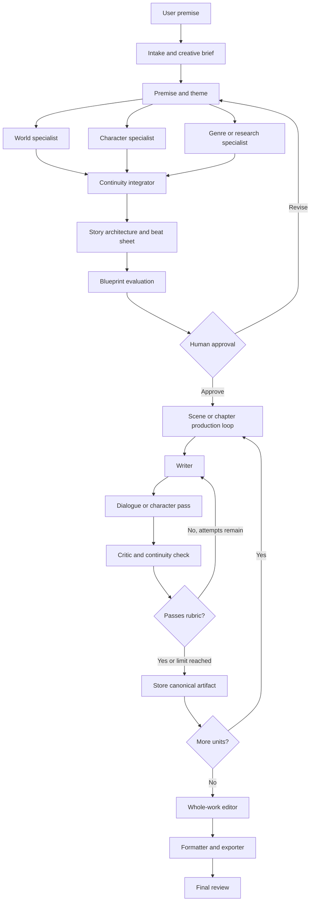

# Recommended creative workflow

## Recommended agent catalog

| Agent | Responsibility | Recommended model class |
|---|---|---|
| Orchestrator | Chooses workflow route, dependencies, budgets, and completion | Strong reasoning model |
| Brainstormer | Generates alternatives, thematic possibilities, reversals | Creative general model |
| World Builder | Locations, society, history, atmosphere, rules | Creative model |
| Character Architect | Psychology, goals, contradictions, arcs, relationships | Strong creative/reasoning model |
| Story Architect | Acts, beats, causality, tension, pacing | Strong reasoning model |
| Researcher | Factual grounding when requested | Tool-capable model |
| Scene Planner | Scene goals, conflict, reveal, entry/exit state | Affordable reasoning model |
| Writer | Produces prose or screenplay units | Best available prose model |
| Character Actor | Writes or critiques one character’s dialogue and behavior | Creative model; current engine concept |
| Dialogue Director | Reconciles character passes into one coherent scene | Strong dialogue model |
| Continuity Supervisor | Detects contradictions and unresolved setup | Reliable structured-output model |
| Critic | Scores against a defined rubric | Independent evaluator model |
| Editor | Whole-work voice, rhythm, repetition, clarity | Best editing model |
| Formatter | Deterministic conversion and validation | Code, not an LLM |

Not every story needs every specialist. The graph should choose the smallest useful team.